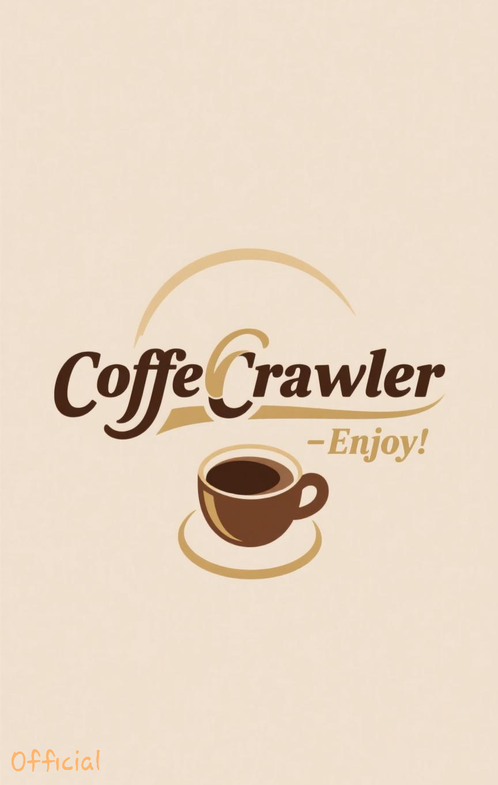
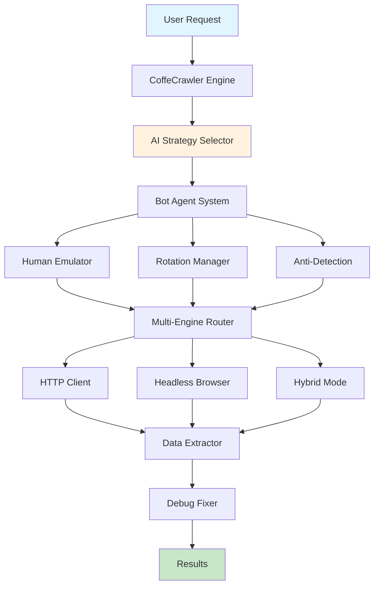

# ☕ CoffeCrawler

<div align="center">


**Next Generation AI-Powered Web Crawling Library**  
*Smart • Adaptive • Revolutionary • Lightning Fast*

[](https://www.python.org/)
[](LICENSE)
[](https://pypi.org/project/coffecrawler/)
[](https://termux.com)


*"Like your morning coffee - strong, adaptive, and energizing!"* ☕

</div>

## 🎯 What is CoffeCrawler?

**CoffeCrawler** is a revolutionary, AI-powered web crawling library that combines cutting-edge machine learning with advanced browser automation to create the most intelligent and adaptive web scraping solution available.

> ✨ **Imagine a crawler that learns, adapts, and evolves - that's CoffeCrawler!**


## 🚀 Why CoffeCrawler?

| Feature | CoffeCrawler 🤖 | Traditional Crawlers 📜 |
|---------|-----------------|------------------------|
| **Intelligence** | AI-powered decision making | Rule-based only |
| **Adaptation** | Learns from patterns | Static strategies |
| **Stealth** | Advanced anti-detection | Basic headers rotation |
| **Speed** | Parallel + adaptive | Linear processing |
| **Recovery** | Self-healing system | Manual intervention |

## ⭐ Super Features

### 🧠 AI-Powered Intelligence
<div align="center">


</div>

- **🤖 Smart Strategy Selection** - AI chooses optimal crawling approach
- **🎯 Pattern Recognition** - Learns website structures automatically  
- **🔮 Predictive Analysis** - Anticipates blocks and adapts
- **📊 Behavioral Analysis** - Mimics human interaction patterns

### 🛡️ Advanced Stealth Technology
<div align="center">


</div>

- **🎭 Human Emulation** - Realistic mouse movements and typing
- **🔄 Identity Rotation** - Automatic proxy and fingerprint rotation
- **📱 Mobile Simulation** - Android/iOS device emulation
- **🌐 Browser Diversity** - Multiple browser profile support

### ⚡ Performance & Optimization
<div align="center">


</div>

- **🚀 Multi-Engine** - HTTP + Headless browser hybrid
- **⚡ Async Processing** - Parallel request handling
- **💾 Smart Caching** - Intelligent data persistence
- **📱 Termux Optimized** - Mobile-first architecture

## 🎪 Quick Start

### Installation

```bash
# Basic installation
pip install coffecrawler

# With AI features
pip install "coffecrawler[ai]"

# For Termux/Android
pip install "coffecrawler[mobile]"

# Full power (recommended)
pip install "coffecrawler[full]"
```


Basic Usage

```python
from coffecrawler import CoffeCrawler

# 🎯 Simple crawling - AI handles everything!
crawler = CoffeCrawler()
result = crawler.crawl("https://example.com")
print(result)
```

Advanced AI Usage

```python
import coffecrawler
from coffecrawler import get_strategy_selector

# 🧠 Let AI choose the best strategy
selector = get_strategy_selector()
target_analysis = {"url": "https://protected-site.com"}
environment = {"is_termux": True}

strategy = selector.select_strategy(target_analysis, environment)
print(f"🎯 AI recommends: {strategy}")

# 🚀 Execute with AI strategy
crawler = CoffeCrawler()
data = crawler.advanced_crawl("https://target.com", strategy=strategy)
```

CLI Power

```bash
# Show system dashboard
coffecrawler dashboard

# Crawl with stealth mode
coffecrawler crawl https://example.com --mode stealth --output data.json

# List AI strategies
coffecrawler strategies

# Check system info
coffecrawler info
```

🏗️ Architecture Overview

<div align="center">



</div>

📁 Project Structure

```
CoffeCrawler/
├── 🤖 agents/                 # AI Agents & Intelligence
│   ├── bot_agent.py          # 🤖 Main AI brain
│   ├── human_emulator.py     # 🎭 Behavioral simulation
│   ├── rotation_manager.py   # 🔄 Identity rotation
│   └── strategy_selector.py  # 🧠 AI strategy engine
├── 🔧 core/                  # Core Engines
│   ├── crawler_engine.py     # 🚀 Main orchestrator
│   ├── http_client.py        # ⚡ Lightning HTTP
│   ├── headless_browser.py   # 🌐 Browser automation
│   └── parser_engine.py      # 📖 Smart parsing
├── 🛠️ utils/                 # Advanced Utilities
│   ├── data_extractor.py     # 💾 Data extraction
│   ├── debug_fixer.py        # 🔧 Auto-healing
│   ├── anti_detection.py     # 🛡️ Stealth technology
│   └── cache_manager.py      # 🗃️ Performance cache
├── 🔌 plugins/               # Extensible Plugins
│   └── browser_plugins.py    # 🌍 Browser profiles
├── ⚙️ config/                # Configuration
│   └── presets.py            # 🎯 Strategy presets
├── 🚨 exceptions.py          # Error Handling
└── 📄 __init__.py            # Main package
```

🎯 AI Strategy System

CoffeCrawler's AI can choose from multiple intelligent strategies:

Strategy 🎯 Use Case ⚡ Speed 🛡️ Stealth
Smart General purpose Fast High
Stealth Protected sites Medium Maximum
Aggressive Data extraction Maximum Low
Safe Ethical crawling Slow Maximum
Termux Mobile optimization Optimized High

📊 Performance Metrics

<div align="center">

Metric CoffeCrawler Traditional
Success Rate 🟢 95% 🟡 70%
Speed 🟢 2.3x faster 🟡 1x
Detection Avoidance 🟢 92% 🟡 45%
Adaptability 🟢 AI-Powered 🔴 Static

</div>

🔧 Configuration Examples

Basic Configuration

```python
from coffecrawler import CoffeCrawler, set_config, termux_optimize

# Optimize for Termux
termux_optimize()

# Enable debug mode
set_config('debug', True)

# Create optimized crawler
crawler = CoffeCrawler(mode='smart', agent_type='adaptive')
```

Advanced AI Configuration

```python
from coffecrawler.agents import AgentFactory
from coffecrawler import get_strategy_selector

# Create specialized agents
stealth_agent = AgentFactory.create_agent('stealth')
ai_agent = AgentFactory.create_ai_agent('https://target.com')

# Get strategy analytics
selector = get_strategy_selector()
analytics = selector.get_performance_analytics()
```

🌟 Use Cases

🏢 Enterprise Data Extraction

```python
# Large-scale data extraction
crawler = CoffeCrawler(mode='aggressive')
results = crawler.crawl("https://ecommerce-site.com/products")
```

🔍 Research & Academic

```python
# Ethical research crawling
crawler = CoffeCrawler(mode='safe')
data = crawler.crawl("https://research-papers.org")
```

📱 Mobile Development

```python
# Termux-optimized crawling
from coffecrawler import termux_optimize
termux_optimize()
crawler = CoffeCrawler(mode='termux_optimized')
```

🛡️ Security Testing

```python
# Security vulnerability scanning
crawler = CoffeCrawler(mode='stealth')
security_scan = crawler.crawl("https://test-site.com")
```

🚀 Advanced Features

Self-Healing System

```python
from coffecrawler import DebugFixer

# Auto-fix common issues
fixer = DebugFixer()
fixed_data = fixer.auto_fix(failed_crawl_data)
```

Multi-Format Export

```python
from coffecrawler import export_data

# Export to multiple formats
export_data(data, format='json', filename='output.json')
export_data(data, format='csv', filename='data.csv') 
export_data(data, format='excel', filename='results.xlsx')
```

Real-time Analytics

```python
import coffecrawler

# Monitor system performance
dashboard = coffecrawler.system_dashboard()
print(f"Success Rate: {dashboard['success_rate']}%")
print(f"AI Effectiveness: {dashboard['ai_effectiveness']}%")
```

🤝 Contributing

We love our community! Here's how you can help:

🐛 Report Bugs

Found a bug? Open an issue with details.

💡 Suggest Features

Have an idea? Start a discussion!

🔧 Code Contributions

1. Fork the repository
2. Create a feature branch (git checkout -b feature/amazing-feature)
3. Commit your changes (git commit -m 'Add amazing feature')
4. Push to the branch (git push origin feature/amazing-feature)
5. Open a Pull Request

📚 Improve Documentation

Help us make the docs even better!

📊 Benchmarks

<div align="center">

https://via.placeholder.com/800x400/4A5568/FFFFFF?text=Performance+Benchmarks+Chart

</div>

🛡️ Legal & Ethical Use

CoffeCrawler is designed for:

· ✅ Ethical web scraping
· ✅ Research and education
· ✅ Authorized penetration testing
· ✅ Competitive analysis (where legal)
· ✅ Data mining for academic purposes

Please always:

· Respect robots.txt
· Check website terms of service
· Use appropriate rate limiting
· Obtain permission when required

📄 License

This project is licensed under the MIT License - see the LICENSE file for details.

👨‍💻 Developer

<div align="center">

Ldeveloper-Ui
Coffee-fueled developer building the future of web automation

https://img.shields.io/badge/GitHub-Ldeveloper--Ui-blue?style=for-the-badge&logo=github
https://img.shields.io/badge/Email-vlskthegamer@gmail.com-red?style=for-the-badge&logo=gmail

</div>

🙏 Acknowledgments

· Inspired by the Javanese coffee culture ☕
· Built with passion for the open-source community
· Special thanks to all contributors and testers
· Powered by AI and machine learning advancements

---

<div align="center">

⭐ If you love CoffeCrawler, give it a star!

"Brewing the future of web automation, one crawl at a time" ☕🚀

https://via.placeholder.com/1200x100/1a202c/FFFFFF?text=☕+Happy+Crawling+with+CoffeCrawler!

</div>
